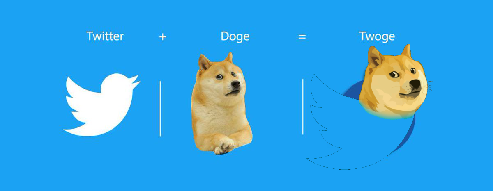

# 🐦 Twoge - Twitter Alternative Deployment with Kubernetes and AWS EKS 🚀

Welcome to the deployment guide for **Twoge**, a Python Flask-based Twitter alternative! In this guide, you'll learn how to deploy Twoge on **Minikube** for local development and scale it to **AWS EKS** for production.

---

## 🚀 Project Overview

Twoge is a simple Twitter alternative built with Python Flask. The goal of this project is to demonstrate how to deploy containerized applications using Kubernetes on Minikube and AWS EKS.

**Key Features:**
- 📦 Dockerized Python Flask app
- 🐘 PostgreSQL database with persistent storage
- 🔐 Configured with ConfigMaps and Secrets
- 🌍 Exposed via LoadBalancer for AWS EKS
- ⚙️ Optional CI/CD pipeline with GitHub Actions

---

## 📋 Assessment Objectives
1. **Dockerize the Application:** Create a Docker image for the Twoge application.
2. **Deploy on Minikube:** Set up Kubernetes deployments and services for local development.
3. **Configure Database:** Use ConfigMaps and Secrets to configure PostgreSQL.
4. **Namespace:** Organize resources in a dedicated namespace.
5. **Probes:** Implement liveness or startup probes for lifecycle management.
6. **Persistent Storage:** Attach a Persistent Volume Claim (PVC) for database persistence.
7. **Deploy on AWS EKS:** Migrate deployment to AWS EKS with LoadBalancer.
8. **CI/CD Pipeline:** (Optional) Implement CI/CD with GitHub Actions.

# **Twoge**

<h1 align="center">
	
</h1>

Twoge is a social media platform dedicated solely to tweets about Dodge. This application is built using Flask, SQLAlchemy, and PostgreSQL.

<h1 align="center">
	
</h1>

## **Prerequisites**

Before you can launch Twoge, you will need to have the following software installed on your system:

- Python 3
- Flask
- SQLAlchemy
- PostgreSQL

## **Getting started**

To get started with Twoge, follow these steps:

1. Clone the repository to your local machine.
2. Create a virtual environment for the project and activate it.
3. Install the required packages using **`pip install -r requirements.txt`**.
4. Create a PostgreSQL database for the application.
5. Set the **`DATABASE_URL`** environment variable to the URL of your PostgreSQL database.
6. Run the application using **`python app.py`**.
7. Navigate to **`http://localhost:5000`** in your web browser to use Twoge.

## **Table attributes**

Twoge has a single table in its database, which stores information about each tweet. The table has the following attributes:

- **`date_posted`**: The date and time when the tweet was posted.
- **`author`**: The user who posted the tweet.
- **`title`**: The title of the tweet.
- **`content`**: The content of the tweet.
